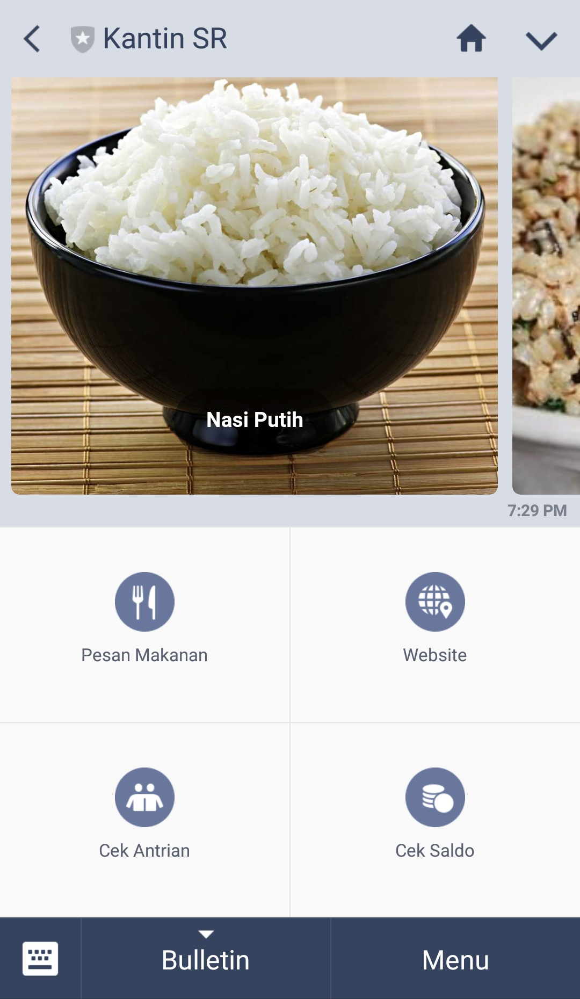

# Kantin SR

Mempermudah pemesanan makanan di kantin seni rupa. 

[Homepage](https://kantinsr.herokuapp.com/)

## How To Use
Tutorial ini akan menunjukkan cara penggunaan program ini

### Prerequisites
1. Python
2. Postgresql
3. Python libraries (flask, psycopg2, linebotsdk, etc)
4. Heroku account
5. Github account
6. Line channel

### Deploy the Project
Untuk menggunakan bot ini, silahkan upload files program ke github dan deploy ke heroku. Setelah itu lakukan konfigurasi agar program yang telah di deploy dapat terhubung pada line channel.

## Running the Program
Silahkan add bot pada line dan bot akan otomatis mendaftarkan akun line anda kedalam sistem.

## Authors
__Group 10 of SPARTA 2017__:

* __Alifio__
* __Almyra R__
* __Ariel Razumardi__
* __Christopher Billy__
* __Hans__
* __Bariansyah__
* __Joe__
* __N Hakim__
* __Nada Afra__
* __Nando Rusrin P__
* __Nicholaus__
* __Stefanus Ardi M__
* __Dita__
* __Yoel Susanto__

## QR Code to line bot:

